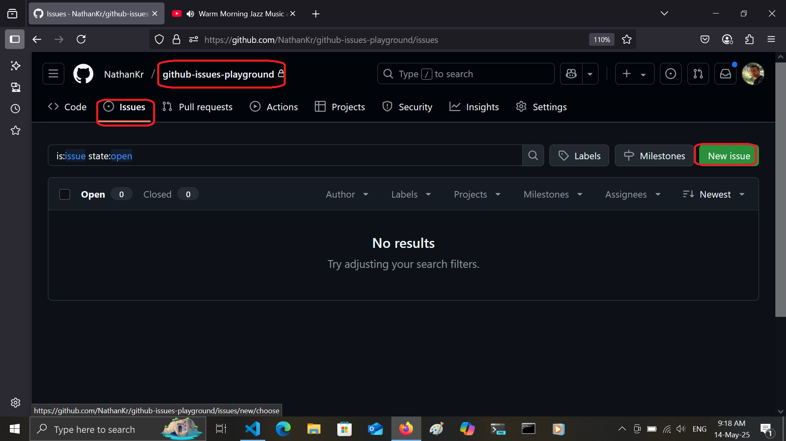
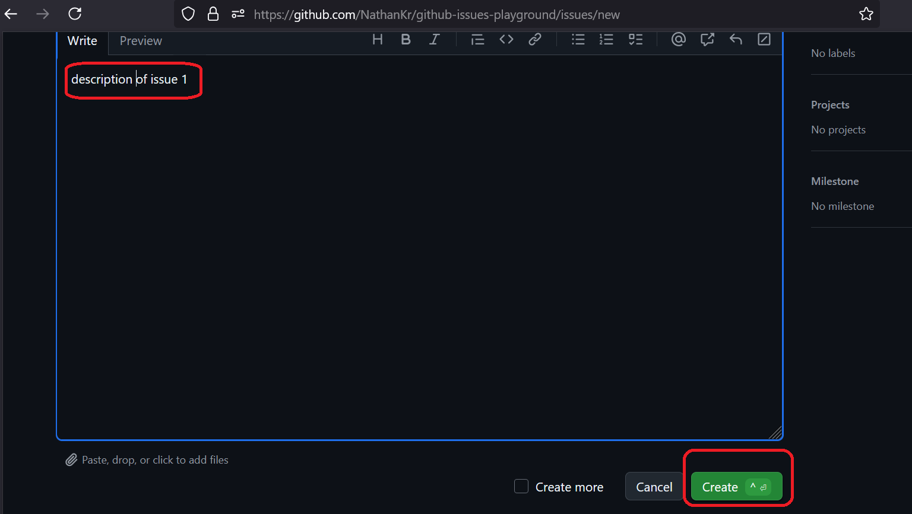
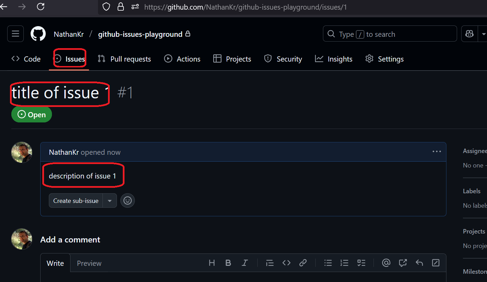

<h1>Project Name</h1>
<h2>Introduction to Github Issues</h2>

<h2>Project Description</h2>

This project serves as a straightforward introduction to utilizing GitHub Issues for effective project management within the GitHub platform. It guides users through the process of creating issues for bug reporting and for defining the scope of work for pull requests, emphasizing clear communication and collaboration.

<h2>Motivation</h2>

You have a github project and you have a bug or you want to create a scope of work for a pull request to be later referenced. How do you do it within the same GitHub project?

<h2>Installation</h2>

No installation is required; it's part of the GitHub dashboard.

<h2>Technologies Used</h2>

GitHub Issues - This is the suggested tool.

<h2>Usage</h2>

<h3>Create a Bug Report Using an Issue</h3>
<ol>
  <li>Navigate to the <strong>"Issues"</strong> Tab: On your GitHub project page, click on the "Issues" tab.</li>
  <li>Click <strong>"New issue"</strong>: On the Issues page, click the green "New issue" button.</li>
  <li>Choose a Template (Optional but Recommended): If available, select a "Bug report" template for a structured report.</li>
  <li>Write a Clear and Concise Title: In the "Title" field, briefly summarize the bug (e.g., "Login button broken on mobile").</li>
  <li>Provide a Detailed Description: In the description area, include:
    <ul>
      <li><strong>Steps to Reproduce:</strong> Exact steps to encounter the bug.</li>
      <li><strong>Expected Behavior:</strong> What should have happened.</li>
      <li><strong>Actual Behavior:</strong> What actually occurred (including error messages).</li>
      <li><strong>Environment:</strong> Browser, OS, device, etc.</li>
      <li><strong>Screenshots/Screen Recordings:</strong> Visual evidence is helpful.</li>
      <li><strong>Error Messages:</strong> Copy and paste any error messages.</li>
      <li><strong>Priority/Severity (Optional):</strong> Indicate the bug's importance.</li>
    </ul>
  <li>Assign Labels (Optional but Useful): Categorize the bug with labels (e.g., "bug", "frontend").</li>
  <li>Assign an Assignee (Optional): If you know who will fix it, assign the issue.</li>
  <li>Click <strong>"Submit new issue"</strong>.</li>
</ol>

<h3>Create a Scope of Work (SOW) Using an Issue to Be Referenced Later in a Pull Request</h3>
<ol>
  <li>Navigate to the <strong>"Issues"</strong> Tab.</li>
  <li>Click <strong>"New issue"</strong>.</li>
  <li>Choose a Template (Optional but Recommended): If available, select a feature request template.</li>
  <li>Write a Descriptive Title: Clearly outline the work (e.g., "Implement user profile page").</li>
  <li>Define the Scope in Detail: Include:
    <ul>
      <li><strong>Goal/Objective:</strong> Purpose of this work.</li>
      <li><strong>Detailed Requirements:</strong> Specific, actionable tasks (use checklists: <code>- [ ] Task</code>).</li>
      <li><strong>Acceptance Criteria:</strong> Conditions for completion (testable).</li>
      <li><strong>Design Specifications/Mockups (If Applicable):</strong> Links to designs.</li>
      <li><strong>Technical Considerations:</strong> Technical approaches, constraints.</li>
      <li><strong>Out of Scope:</strong> What's explicitly <em>not</em> included.</li>
    </ul>
  <li>Assign Labels (Optional but Useful): Use labels like "feature", "scope".</li>
  <li>Assign an Assignee (Optional).</li>
  <li>Click <strong>"Submit new issue"</strong>.</li>
  <li><strong>Reference the Issue in Your Pull Request:</strong> When creating a PR for this scope, include <code>#IssueNumber</code> in the description (e.g., "Implements user profile page as described in #42").</li>
</ol>

<h2>Demo</h2>

<h3>Create a simple issue</h3>

Create a new issue by clicking on the "New issue" button.

Add a title and description as shown in the image.

Click on the "Create" button as shown in the image.

Issue1 is created as shown in the image.

This issue can be a bug report or a SOW that you can reference later in a PR.

<h2>Points of Interest</h2>
<ul>
    <li>React, Next.js, Node.js, and Vite use GitHub Issues to track bugs and feature discussions, and pull requests (PRs) frequently reference these issues to maintain transparency and streamline collaboration.</li>
</ul>

<h2>References</h2>
<ul>
    <li><a href='https://github.com/features/issues'>official docs</a></li>
</ul>
